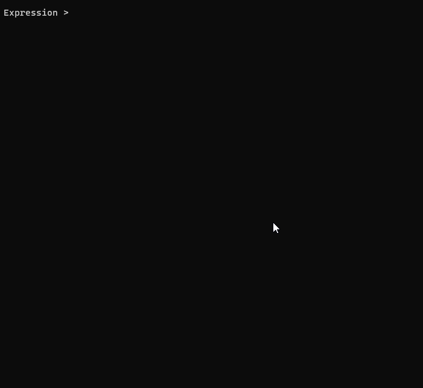

# TeX -> IL Code

TexToIL is a compiler for TeX math expressions. They are lexed, parsed, assembled into an AST, and ultimately compiled into a lambda function. The variables in the original expression are used as parameters in the lambda function which can be called with new parameters for free without recompiling the original expression.

Example usage can be seen in [Program.cs](./LatexProcessing2/Program.cs)

---

(Here we use `+` instead of `\pm` because the lambda function must have a single return value.)

